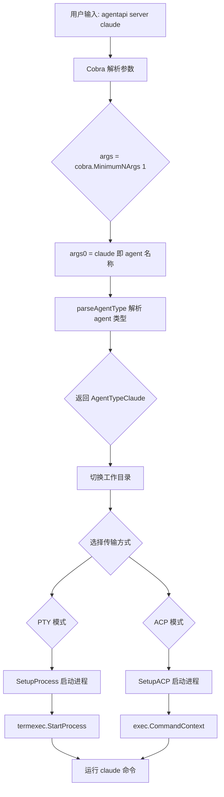
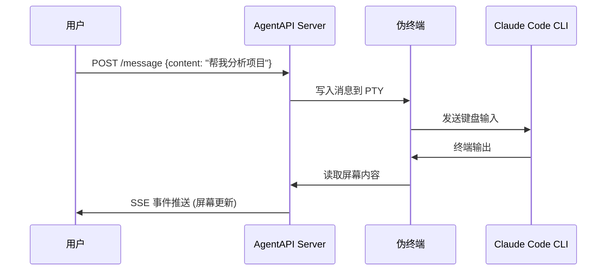

# AgentAPI 启动 Claude Code 的内部逻辑分析

## 如述

当你执行 `agentapi server claude` 时，AgentAPI 内部会启动一个 PTY（伪终端）进程来运行 Claude Code CLI。本文档详细分析这个启动流程。

## 命令解析流程



## 核心代码流程

### 1. 参数解析

**文件**: `cmd/server/server.go`

```go
// 命令定义
serverCmd := &cobra.Command{
    Use:  "server [agent]",
    Args: cobra.MinimumNArgs(1),  // 至少需要 1 个参数
    Run: func(cmd *cobra.Command, args []string) {
        // args[0] = "claude" (agent 名称)
        // args[1:] = 额外参数 (在 -- 之后)
        runServer(ctx, logger, cmd.Flags().Args())
    },
}
```

### 2. Agent 类型识别

**文件**: `cmd/server/server.go`

```go
func runServer(ctx context.Context, logger *slog.Logger, argsToPass []string) error {
    agent := argsToPass[0]  // "claude"
    agentTypeValue := viper.GetString(FlagType)  // --type 参数
    agentType, err := parseAgentType(agent, agentTypeValue)
    // agentType = AgentTypeClaude
}

// agent 类型别名映射
var agentTypeAliases = map[string]AgentType{
    "claude":       AgentTypeClaude,
    "goose":        AgentTypeGoose,
    // ...
}
```

### 3. 工作目录切换

**文件**: `cmd/server/server.go`

```go
projectDir := viper.GetString(FlagProjectDir)  // --project-dir 或 -d 参数
if projectDir != "" {
    absPath, err := filepath.Abs(projectDir)
    // 如果目录不存在, 自动创建
    if _, err := os.Stat(absPath); os.IsNotExist(err) {
        os.MkdirAll(absPath, 0755)
    }
    os.Chdir(absPath)  // 切换工作目录
}
```

### 4. 传输方式选择

**文件**: `cmd/server/server.go`

```go
experimentalACP := viper.GetBool(FlagExperimentalACP)

if experimentalACP {
    // ACP 模式 - 使用 Agent Communication Protocol
    acpResult, err = httpapi.SetupACP(ctx, httpapi.SetupACPConfig{
        Program:     agent,        // "claude"
        ProgramArgs: argsToPass[1:],  // 额外参数
    })
} else {
    // PTY 模式 - 使用伪终端 (默认)
    proc, err := httpapi.SetupProcess(ctx, httpapi.SetupProcessConfig{
        Program:        agent,           // "claude"
        ProgramArgs:    argsToPass[1:],  // 额外参数
        TerminalWidth:  termWidth,       // 80 (默认)
        TerminalHeight: termHeight,      // 1000 (默认)
        AgentType:      agentType,       // AgentTypeClaude
    })
}
```

## 实际执行的命令

### PTY 模式 (默认)

**文件**: `lib/httpapi/setup.go`

```go
func SetupProcess(ctx context.Context, config SetupProcessConfig) (*termexec.Process, error) {
    // 日志输出
    logger.Info(fmt.Sprintf("Running: %s %s", config.Program, strings.Join(config.ProgramArgs, " ")))

    // 启动 PTY 进程
    process, err := termexec.StartProcess(ctx, termexec.StartProcessConfig{
        Program:        config.Program,        // "claude"
        Args:           config.ProgramArgs,   // []
        TerminalWidth:  config.TerminalWidth, // 80
        TerminalHeight: config.TerminalHeight,// 1000
    })
}
```

**最终执行**:
```bash
claude
```

### ACP 模式 (实验性)

**文件**: `lib/httpapi/setup.go`

```go
func SetupACP(ctx context.Context, config SetupACPConfig) (*SetupACPResult, error) {
    args := config.ProgramArgs
    logger.Info(fmt.Sprintf("Running (ACP): %s %s", config.Program, strings.Join(args, " ")))

    cmd := exec.CommandContext(ctx, config.Program, args...)
    // 启动子进程
    cmd.Start()
}
```

## Claude Code 接收的参数

### 直接传递的参数

当使用 `--` 分隔符时, 后面的参数会直接传给 Claude Code:

```powershell
agentapi server claude -- --dangerously-skip-permissions --verbose
```

这会执行:
```bash
claude --dangerously-skip-permissions --verbose
```

### AgentAPI 处理的参数

| 参数 | 说明 | 对 Claude 的影响 |
|------|------|-----------------|
| `-p, --port` | API 服务端口 | 无 (AgentAPI 自己处理) |
| `-d, --project-dir` | 工作目录 | 通过 `os.Chdir()` 影响 Claude 的运行目录 |
| `-W, --term-width` | 终端宽度 | 传递给 PTY, 影响 Claude 的显示宽度 |
| `-H, --term-height` | 终端高度 | 传递给 PTY, 影响 Claude 的显示高度 |
| `-I, --initial-prompt` | 初始提示词 | 启动后发送给 Claude |
| `-t, --type` | Agent 类型覆盖 | 无 (已经通过位置参数指定) |

## 数据流



## 终端模拟

AgentAPI 使用 PTY (伪终端) 来模拟真实的终端环境:

**文件**: `lib/termexec/process.go`

```go
type StartProcessConfig struct {
    Program        string   // "claude"
    Args           []string // 额外参数
    TerminalWidth  uint16   // 80 (默认)
    TerminalHeight uint16   // 1000 (默认)
}
```

这样 Claude Code 会认为自己运行在一个真实的终端中, 支持:
- 颜色输出
- 光标移动
- 屏幕刷新
- 交互式输入

## 完整启动示例

```powershell
# 基本启动
agentapi server claude
# 内部执行: claude (在当前目录的 PTY 中)

# 指定工作目录
agentapi server claude -d D:\MyProject
# 1. os.Chdir("D:\MyProject")
# 2. 内部执行: claude (在新目录的 PTY 中)

# 传递参数给 Claude
agentapi server claude -- --dangerously-skip-permissions
# 内部执行: claude --dangerously-skip-permissions

# 组合使用
agentapi server claude -d D:\MyProject -p 3285 -- --verbose
# 1. os.Chdir("D:\MyProject")
# 2. 在端口 3285 启动 API 服务
# 3. 内部执行: claude --verbose
```

## 关键文件

| 文件 | 职责 |
|------|------|
| `cmd/server/server.go` | 命令行解析、参数处理、主流程控制 |
| `lib/httpapi/setup.go` | 进程启动逻辑 (PTY/ACP) |
| `lib/termexec/process.go` | PTY 进程管理 |
| `lib/httpapi/server.go` | HTTP API 服务器 |
| `lib/screentracker/conversation.go` | 对话管理和屏幕跟踪 |

## Chat UI 构建注意事项

### Next.js 静态导出配置

**文件**: `chat/next.config.ts`

```typescript
const nextConfig: NextConfig = {
  output: "export",  // 启用静态导出
  images: { unoptimized: true },
  basePath,
  assetPrefix: `${basePath}/`,
  trailingSlash: true,
};
```

### 构建输出目录

当使用 `output: "export"` 时，Next.js 将静态文件输出到 `chat/out/` 目录：

```
chat/out/
├── index.html          # 主页面
├── embed/              # 嵌入模式页面
├── embed.html
├── _next/              # 静态资源 (JS, CSS)
│   └── static/
├── favicon.ico
└── 404.html            # 404 页面
```

**注意**: 不要使用 `.next/server/app/` 目录，该目录包含服务器端渲染的 JS 文件（如 page.js），会导致 Chat UI 显示原始 JS 内容而非 HTML 页面。

### 构建脚本

**文件**: `build.ps1`

```powershell
# 正确: 使用静态导出目录
$nextOut = "chat/out"
Copy-Item -Recurse -Force "chat\out\*" lib\httpapi\chat\

# 错误: 使用服务器端输出目录 (会导致问题)
# Copy-Item -Recurse -Force "chat\.next\server\app\*" lib\httpapi\chat\
```

### 常见问题排查

| 问题 | 原因 | 解决方案 |
|------|------|---------|
| 显示 page.js 等原始文件 | 使用了错误的服务器端输出目录 | 使用 `chat/out/` 目录 |
| 404 目录路径错误 | Windows 路径分隔符问题 | 构建时删除 404 目录 |
| 静态资源加载失败 | basePath 配置不正确 | 确保 `NEXT_PUBLIC_BASE_PATH` 正确设置 |

## 相关链接

- [AgentAPI GitHub](https://github.com/coder/agentapi)
- [PTY (伪终端) 详解](https://en.wikipedia.org/wiki/Pseudoterminal)
- [Next.js 静态导出](https://nextjs.org/docs/app/building-your-application/deploying/static-exports)
