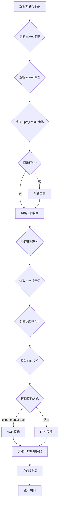

# AgentAPI Server 参数和命令逻辑

## 概述

`agentapi server` 命令用于启动一个 HTTP API 服务器，该服务器包装各种 AI 编程助手（如 Claude Code、Goose、Aider 等）。

## 命令格式

```bash
agentapi server [agent] [flags] -- [agent-args]
```

- `agent`: 必需参数，指定要运行的 agent 类型
- `flags`: agentapi 的配置参数
- `agent-args`: 传递给 agent 的额外参数（在 `--` 之后）

## 参数详解

### 核心参数

| 参数 | 短参数 | 默认值 | 说明 |
|------|--------|--------|------|
| `--type` | `-t` | "" | 覆盖 agent 类型 |
| `--port` | `-p` | 3284 | 服务器监听端口 |
| `--project-dir` | `-d` | "" | Agent 工作目录（项目根目录），不存在会自动创建 |

### 传输和终端参数

| 参数 | 短参数 | 默认值 | 说明 |
|------|--------|--------|------|
| `--experimental-acp` | | false | 使用实验性 ACP 传输（替代 PTY） |
| `--term-width` | `-W` | 80 | 模拟终端宽度 |
| `--term-height` | `-H` | 1000 | 模拟终端高度 |

### HTTP 安全参数

| 参数 | 短参数 | 默认值 | 说明 |
|------|--------|--------|------|
| `--allowed-hosts` | `-a` | [localhost, 127.0.0.1, [::1]] | 允许的主机名（不含端口） |
| `--allowed-origins` | `-o` | [http://localhost:3284, ...] | CORS 允许的来源 |
| `--chat-base-path` | `-c` | /chat | Chat UI 的基础路径 |

### 交互参数

| 参数 | 短参数 | 默认值 | 说明 |
|------|--------|--------|------|
| `--initial-prompt` | `-I` | "" | 初始提示词（可从 stdin 读取） |

### 状态持久化参数

| 参数 | 短参数 | 默认值 | 说明 |
|------|--------|--------|------|
| `--state-file` | `-s` | "" | 状态保存文件路径 |
| `--load-state` | | false | 启动时加载状态（设置 state-file 时默认 true） |
| `--save-state` | | false | 关闭时保存状态（设置 state-file 时默认 true） |

### 其他参数

| 参数 | 短参数 | 默认值 | 说明 |
|------|--------|--------|------|
| `--pid-file` | | "" | PID 文件路径（用于关闭脚本） |
| `--print-openapi` | `-P` | false | 打印 OpenAPI schema 并退出 |

## 支持的 Agent 类型

| Agent | 说明 | 自动检测 |
|-------|------|----------|
| `claude` | Claude Code | 是 |
| `goose` | Goose | 是 |
| `aider` | Aider | 是 |
| `codex` | OpenAI Codex | 需要显式指定 --type |
| `gemini` | Gemini CLI | 是 |
| `copilot` | GitHub Copilot | 是 |
| `amp` | Amp | 是 |
| `cursor` | Cursor CLI | 是 |
| `cursor-agent` | Cursor Agent | 是 |
| `amazonq` / `q` | Amazon Q | 是 |
| `opencode` | OpenCode | 是 |
| `custom` | 自定义命令 | 是 |

## 启动流程



## 环境变量

所有参数都可以通过环境变量设置，格式为 `AGENTAPI_<参数名大写>`：

| 参数 | 环境变量 |
|------|---------|
| `--port` | `AGENTAPI_PORT` |
| `--type` | `AGENTAPI_TYPE` |
| `--project-dir` | `AGENTAPI_PROJECT_DIR` |
| `--allowed-hosts` | `AGENTAPI_ALLOWED_HOSTS` (空格分隔) |
| `--allowed-origins` | `AGENTAPI_ALLOWED_ORIGINS` (空格分隔) |

## 使用示例

### 基本启动
```powershell
# 使用默认配置启动 Claude Code
agentapi server claude

# 指定端口和项目目录
agentapi server claude -p 3285 -d D:\MyProject
```

### 多实例启动
```powershell
# 项目A - 端口 3284
agentapi server claude -d D:\ProjectA -p 3284

# 项目B - 端口 3285
agentapi server claude -d D:\ProjectB -p 3285

# 项目C - 端口 3286
agentapi server goose -d D:\ProjectC -p 3286
```

### 使用状态持久化
```powershell
# 保存和加载会话状态
agentapi server claude -s D:\state\session.json
```

### 传递初始提示词
```powershell
# 通过参数
agentapi server claude -I "帮我分析这个项目"

# 通过管道
echo "帮我分析这个项目" | agentapi server claude
```

### 自定义 Agent
```powershell
# 使用自定义命令
agentapi server --type custom -- my-custom-agent --arg1 --arg2
```

## 访问地址

启动后可访问：

| 资源 | URL |
|------|-----|
| Chat UI | http://localhost:3284/chat |
| API | http://localhost:3284 |
| OpenAPI | http://localhost:3284/openapi.json |

## 相关链接

- [AgentAPI GitHub](https://github.com/coder/agentapi)
- [CORS 详解](https://developer.mozilla.org/zh-CN/docs/Web/HTTP/CORS)
