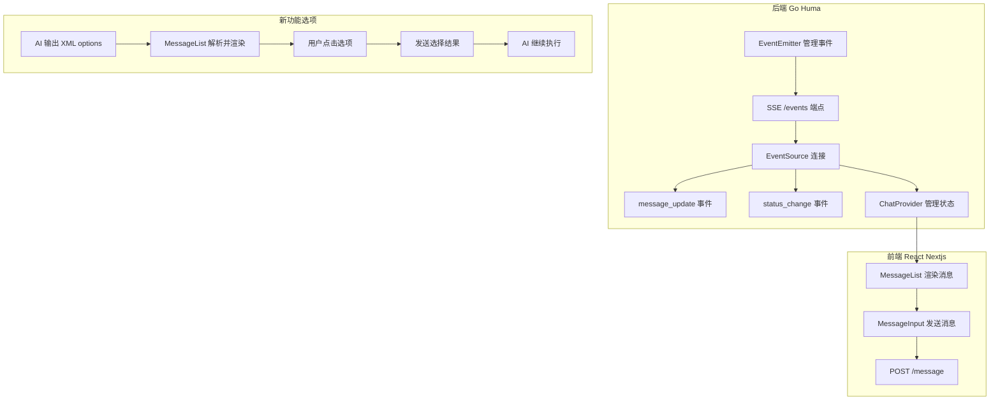
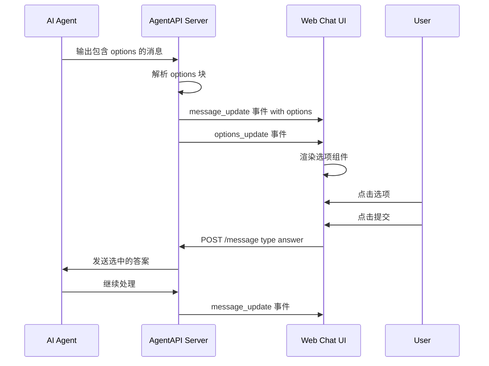

小迈,你好

# AgentAPI 多选项功能实现计划

## 概述

本文档说明如何在 agentapi 项目中实现类似 Happy 项目的多选项功能,允许 AI 在响应中输出选项供用户选择。

## 类比理解

可以将 AI 响应类比为"餐厅点菜" - AI 给出菜单,用户选择菜品
- CLI 中使用 `inquirer` 库 - 用户选择更灵活
- 移动端可以复用这个设计模式

## 当前 AgentAPI 架构



## 实现步骤

### 第1步: 后端 - 添加类型定义

**文件**: `lib/httpapi/events.go`

```go
// 添加新的事件类型
const (
    EventTypeOptionsUpdate EventType = "options_update"
)

// 选项数据结构
type OptionItem struct {
    Label        string `json:"label"`
    Description string `json:"description,omitempty"`
}

type OptionsUpdateBody struct {
    MessageId   int           `json:"message_id"`
    Options     []OptionItem  `json:"options"`
    MultiSelect bool          `json:"multi_select"`
    QuestionId  string        `json:"question_id"`
}
```

### 第2步: 后端 - 修改 EventEmitter

**文件**: `lib/httpapi/events.go`

在 EventEmitter 结构体中添加:

```go
func (e *EventEmitter) EmitOptions(messageId int, options []OptionItem, multiSelect bool, questionId string) {
    e.notifyChannels(EventTypeOptionsUpdate, OptionsUpdateBody{
        MessageId:   messageId,
        Options:     options,
        MultiSelect: multiSelect,
        QuestionId:  questionId,
    })
}
```

### 第3步: 后端 - 添加消息类型

**文件**: `lib/httpapi/models.go`

```go
type MessageType string

const (
    MessageTypeUser   MessageType = "user"
    MessageTypeRaw    MessageType = "raw"
    MessageTypeAnswer MessageType = "answer"  // 新增
)

type MessageRequest struct {
    Type    MessageType `json:"type,omitempty"`
    Content string      `json:"content"`
    // 新增: 选项回答
    QuestionId string `json:"question_id,omitempty"`
    Answers    []int  `json:"answers,omitempty"`
}
```

### 第4步: 后端 - 修改消息处理

**文件**: `lib/httpapi/server.go`

修改 `createMessage` 函数:

```go
func (s *Server) createMessage(ctx context.Context, input *MessageRequest) (*MessageResponse, error) {
    s.mu.Lock()
    defer s.mu.Unlock()

    switch input.Body.Type {
    case MessageTypeUser:
        if err := s.conversation.Send(FormatMessage(s.agentType, input.Body.Content)); err != nil {
            return nil, xerrors.Errorf("failed to send message: %w", err)
        }
    case MessageTypeRaw:
        if _, err := s.agentio.Write([]byte(input.Body.Content)); err != nil {
            return nil, xerrors.Errorf("failed to send message: %w", err)
        }
    case MessageTypeAnswer:
        // 新增: 处理选项回答
        if len(input.Body.Answers) > 0 {
            // 将选中的选项发送给 AI
            answerText := formatAnswers(input.Body.Answers, options)
            if err := s.conversation.Send(FormatMessage(s.agentType, answerText)); err != nil {
                return nil, xerrors.Errorf("failed to send answer: %w", err)
            }
        }
    }
    // ...
}
```

### 第5步: 前端 - 添加类型定义

**文件**: `chat/src/components/chat-provider.tsx`

```tsx
// 新增选项相关类型
interface OptionItem {
  label: string;
  description?: string;
}

interface OptionsUpdateEvent {
  message_id: number;
  options: OptionItem[];
  multi_select: boolean;
  question_id: string;
}

// 扩展 ChatContextValue
interface ChatContextValue {
  // ... existing fields
  options: OptionsUpdateEvent | null;
  sendAnswer: (questionId: string, answers: number[]) => void;
}
```

### 第6步: 前端 - 修改 ChatProvider

**文件**: `chat/src/components/chat-provider.tsx`

```tsx
// 添加选项事件监听
eventSource.addEventListener("options_update", (event) => {
  const data: OptionsUpdateEvent = JSON.parse(event.data);
  setOptions(data);
});

// 添加发送答案函数
const sendAnswer = async (questionId: string, answers: number[]) => {
  const response = await fetch(`${agentAPIUrl}/message`, {
    method: "POST",
    headers: { "Content-Type": "application/json" },
    body: JSON.stringify({
      type: "answer",
      question_id: questionId,
      answers: answers,
    }),
  });
  // ...
};

// 更新 Context Provider
<ChatContext.Provider
  value={{
    messages,
    loading,
    sendMessage,
    serverStatus,
    uploadFiles,
    agentType,
    options,
    sendAnswer,  // 新增
  }}
>
```

### 第7步: 前端 - 创建 OptionsView 组件

**文件**: `chat/src/components/options-view.tsx`

```tsx
"use client";

import React, { useState } from "react";
import { Button } from "./ui/button";
import { CheckCircle2, Circle } from "lucide-react";

interface OptionItem {
  label: string;
  description?: string;
}

interface OptionsViewProps {
  options: OptionItem[];
  multiSelect: boolean;
  questionId: string;
  onAnswer: (questionId: string, answers: number[]) => void;
  disabled?: boolean;
}

export function OptionsView({
  options,
  multiSelect,
  questionId,
  onAnswer,
  disabled = false,
}: OptionsViewProps) {
  const [selectedIndices, setSelectedIndices] = useState<Set<number>>(new Set());

  const handleOptionClick = (index: number) => {
    if (disabled) return;

    setSelectedIndices(prev => {
      const newSet = new Set(prev);
      if (newSet.has(index)) {
        newSet.delete(index);
      } else {
        if (multiSelect) {
          newSet.add(index);
        } else {
          // 单选模式: 清空并只选当前
          newSet.clear();
          newSet.add(index);
        }
      }
      return newSet;
    });
  };

  const handleSubmit = () => {
    if (selectedIndices.size > 0) {
      const answers = Array.from(selectedIndices).sort();
      onAnswer(questionId, answers);
    }
  };

  return (
    <div className="flex flex-col gap-2 mt-3 mb-4 p-4 border rounded-lg bg-muted/30">
      <div className="flex flex-wrap gap-2">
        {options.map((option, index) => (
          <button
            key={index}
            onClick={() => handleOptionClick(index)}
            disabled={disabled}
            className={`
              flex items-center gap-2 px-4 py-2 rounded-lg border transition-all
              ${selectedIndices.has(index)
                ? "bg-primary text-primary-foreground border-primary"
                : "bg-background hover:bg-accent border-border"
              }
              ${disabled ? "opacity-50 cursor-not-allowed" : "cursor-pointer"}
            `}
          >
            {selectedIndices.has(index) ? (
              <CheckCircle2 className="h-4 w-4" />
            ) : (
              <Circle className="h-4 w-4 opacity-30" />
            )}
            <span className="text-sm font-medium">{option.label}</span>
          </button>
        ))}
      </div>
      {options.some(o => o.description) && (
        <div className="text-xs text-muted-foreground mt-1">
          {options[selectedIndices.values().next().value]?.description}
        </div>
      )}
      <div className="flex justify-end mt-3">
        <Button
          onClick={handleSubmit}
          disabled={disabled || selectedIndices.size === 0}
          size="sm"
        >
          Submit Selection
        </Button>
      </div>
    </div>
  );
}
```

### 第8步: 前端 - 修改 MessageList

**文件**: `chat/src/components/message-list.tsx`

```tsx
import { OptionsView } from "./options-view";

// 扩展 Message 接口
interface Message {
  id: number;
  role: string;
  content: string;
  options?: OptionItem[];      // 新增
  multiSelect?: boolean;       // 新增
  questionId?: string;         // 新增
}

// 在消息渲染中添加选项组件
{message.options && message.options.length > 0 && (
  <OptionsView
    options={message.options}
    multiSelect={message.multiSelect || false}
    questionId={message.questionId!}
    onAnswer={sendAnswer}
    disabled={loading}
  />
)}
```

## 选项解析逻辑

### AI 输出格式

AI 在响应末尾输出 XML 格式的选项:

```
<options>
    <option label="Option 1" description="Description 1" />
    <option label="Option 2" description="Description 2" />
</options>
```

### 后端解析

在 `lib/msgfmt` 包中添加选项解析函数:

```go
// OptionsRegex 匹配 <options>...</options> 块
var OptionsRegex = regexp.MustCompile(`(?s)<options>(.*?)</options>`)

// OptionRegex 匹配单个 <option> 标签
var OptionRegex = regexp.MustCompile(`<option\s+label="([^"]*)"(?:\s+description="([^"]*)")?\s*/?>`)

func ParseOptions(content string) (string, []OptionItem, string) {
    matches := OptionsRegex.FindAllStringSubmatch(content, -1)
    if len(matches) == 0 {
        return content, nil, ""
    }

    var options []OptionItem
    for _, match := range matches {
        optionMatches := OptionRegex.FindAllStringSubmatch(match, -1)
        for _, om := range optionMatches {
            options = append(options, OptionItem{
                Label:        om[1],
                Description: om[2],
            })
        }
    }

    // 移除选项块后的内容
    cleanContent := OptionsRegex.ReplaceAllString(content, "")
    return cleanContent, options, generateQuestionId()
}
```

## 数据流图



## 文件修改清单

| 位置 | 文件 | 修改类型 |
|------|------|---------|
| 后端 | `lib/httpapi/events.go` | 修改 - 添加事件类型和结构 |
| 后端 | `lib/httpapi/models.go` | 修改 - 添加消息类型 |
| 后端 | `lib/httpapi/server.go` | 修改 - 处理 answer 类型消息 |
| 后端 | `lib/msgfmt/options.go` | 新增 - 选项解析逻辑 |
| 前端 | `chat/src/components/chat-provider.tsx` | 修改 - 添加选项状态和发送函数 |
| 前端 | `chat/src/components/options-view.tsx` | 新增 - 选项渲染组件 |
| 前端 | `chat/src/components/message-list.tsx` | 修改 - 渲染选项组件 |

## 测试计划

1. **单元测试**
   - 测试选项解析函数
   - 测试事件发送和接收

2. **集成测试**
   - 测试完整的选项流程
   - 测试单选和多选模式

3. **端到端测试**
   - 测试 AI 输出选项
   - 测试用户选择和提交
   - 测试 AI 接收答案

## 注意事项

1. **XML 解析安全**: 使用正则表达式解析时要注意安全,避免 ReDoS 攻击
2. **状态同步**: 硏保选项状态与消息状态同步
3. **错误处理**: 夶理网络错误和超时情况
4. **用户体验**: 提供清晰的视觉反馈
5. **无障碍**: 确保选项组件支持键盘导航

